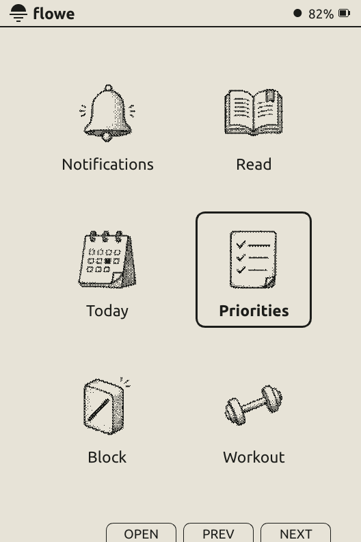
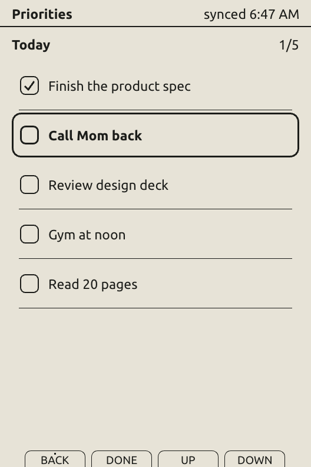
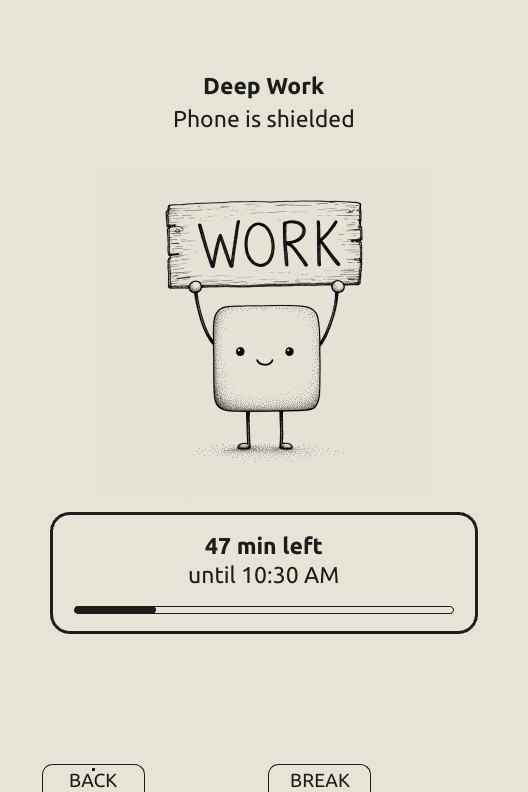
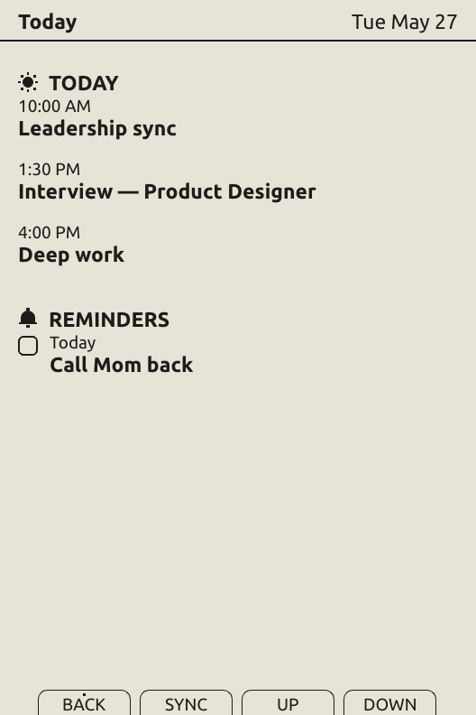
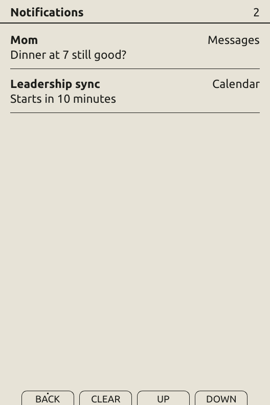
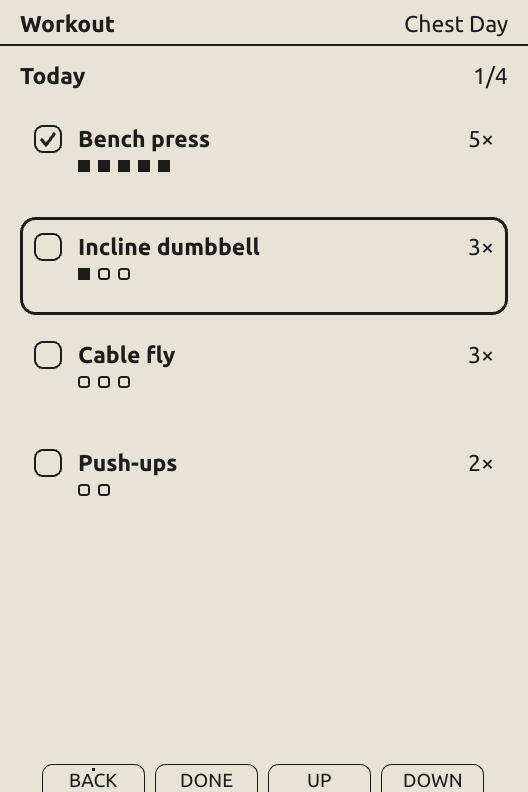
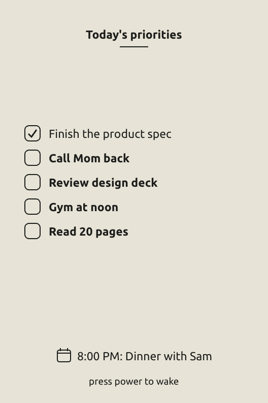

# Flowe OS

Open-source firmware for the pocket-size [Xteink X3 or X4](https://www.xteink.com)
e-ink device. Paired with the Flowe iOS app, it puts your priorities, agenda,
and notifications on calm paper-like glass — and starts focus blocks that
shield the apps you choose on your iPhone.

Part of [Flowe](https://www.flowe.ink). Firmware is MIT-licensed;
vendored libraries keep their own licenses.

**Requires:** an Xteink X3 or X4 (both hardware-validated as of fw-v0.3.0) and an iPhone with the Flowe companion app for everything
beyond reading.

<p align="center">
  
  
  
</p>

## The apps

| | |
|---|---|
| **Priorities** | Speak your morning priorities into the iPhone app; they arrive on ink. Check them off with one key. |
| **Today** | The next 24 hours of your calendar, at a glance. No feed underneath. |
| **Notifications** | Mirrored from your iPhone over ANCS — the same channel a smartwatch uses. Real app names, and missed notifications backfill on reconnect. |
| **Block** | Press the device's side button (or start from the app) and iOS Screen Time shields the apps you chose to block until the countdown ends. The countdown lives on ink; daily count and streak too. |
| **Read** | A full EPUB reader — typeset pages, covers, remembers your place. Books load from the SD card. Works with no phone at all. |
| **Workout** | Your plan for the session; one key press logs a set. The phone stays wherever you left it. |

<p align="center">
  
  
  
  
</p>

## Functional sleep

The device spends most of its life asleep, so the sleep screen earns its
keep: today's priorities as a poster, your next calendar event, and the
state of any running block. Before the panel powers down, the firmware
snapshots the current scene, block state, synced cards, and recent
notifications to on-chip storage (reading position lives on the SD card) —
so wake picks up where you left off.

<p align="center">
  
</p>

## Pairing with the iOS app

Flowe OS pairs like any Bluetooth accessory: open the Flowe app, pick the
device, accept the pairing prompt on your iPhone. One bonded, encrypted BLE
link then carries everything:

- **ANCS** (Apple's notification service) delivers notifications — no
  special entitlements, no private APIs.
- **JSON cards** over a simple GATT service carry priorities, agenda,
  workout plans, and block status. The protocol is small and readable:
  [`xphone-os/src/ble/`](xphone-os/src/ble/).

The iOS app does the phone-side work — speech-to-priorities (parsed
on-device with Apple's models), calendar, Screen Time shields — and ships
via the Flowe beta at [www.flowe.ink](https://www.flowe.ink).
The reader works with no app.

## Performance

The whole OS — BLE, ANCS, EPUB reader, framebuffer — fits in the ESP32-C3's
320 KB of RAM with no PSRAM: the current X3 build uses about 146 KB of RAM
and 2.5 MB of its 6.5 MB app partition.

- **Input stays responsive.** A dedicated 5 ms sampling task latches key
  presses even while the panel is mid-refresh, and display flushes run on a
  worker task so the main loop keeps composing and pumping BLE.
- **Fast, calm refreshes.** Scene changes use the panel's fast waveform
  (~450 ms on the X3, versus ~3 s for a full flash); small updates use
  driver-native partial windows, with periodic full-panel scrubs to keep
  the glass clean.
- **Quiet wake.** Press power to sleep; wake resyncs only what the current
  screen needs and backfills missed notifications, newest first.

## Install

Grab `update.bin` from [Releases](https://github.com/andrewjiang/flowe-os/releases) —
grab the zip for your device (flowe-x3 or flowe-x4); each contains the image. Changelogs live in the [release notes](https://github.com/andrewjiang/flowe-os/releases) — each release lists what changed on the device, pre-named for the SD updater —
or follow the step-by-step guide at
[www.flowe.ink/flash](https://www.flowe.ink/flash).

**SD card** (no data cable needed): copy `update.bin` to the SD root,
insert, hold **Left + Power**. The
updater checks the image's header, segments, checksum, and SHA-256 trailer
before writing the inactive OTA slot, and switches the boot slot only after
every write succeeds.

Going back works the same way: copy a CrossPoint release `firmware.bin`
to the card as `update.bin` — the stock-to-Flowe-to-CrossPoint round trip
is how this firmware was developed.

## Build from source

[PlatformIO](https://platformio.org), two targets:

```sh
cd xphone-os
pio run -e x3            # Xteink X3 (hardware-validated)
pio run -e x4            # Xteink X4 (hardware-validated)
pio run -e x4            # Xteink X4 (compiles; not validated on hardware)
pio run -e x3 -t upload  # flash your build over USB
pio device monitor --baud 115200
```

USB flashing needs the 4-pin data pogo cable — the 2-pin cable bundled with
many X3s is charge-only, so use the SD-card path if the device never
enumerates.

`freeink-sdk/` is the vendored [FreeInk SDK](https://opencollective.com/freeink)
(MIT) — board, display, SD, input, and battery drivers. The EPUB engine is
adapted from [CrossPoint](https://github.com/crosspoint-reader/crosspoint-reader)
(MIT).

## License

MIT for Flowe OS — see [LICENSE](LICENSE). Vendored libraries under
`xphone-os/lib/` and `freeink-sdk/` retain their original licenses
(MIT, Apache-2.0, and Zlib).
